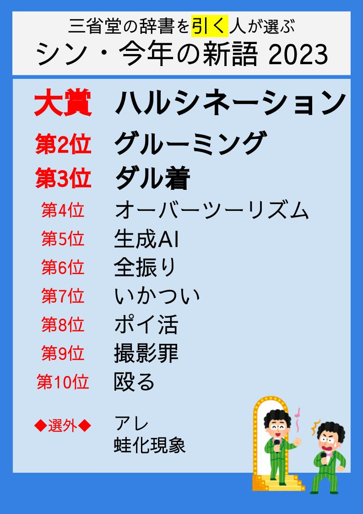

# シン・今年の新語2023 データシート

選考規程
https://docs.google.com/document/d/1tFBT9RZ7-GVzZRH84MHx991svgMrNxLGQMlwRvmAnlU/edit?usp=sharing

シン・選考委員（順不同・敬称略）
* ながさわ（[@kaichosanEX](https://twitter.com/kaichosanEX)）
* 西練馬（[@nishinerima](https://twitter.com/nishinerima)）
* アンゼ（[@anze4fgo](https://twitter.com/anze4fgo)）
* ヤシロ（[@yashiro_with_t](https://twitter.com/yashiro_with_t)）

ノミネート語一覧・選考プロセスなど
https://www.poc39.com/archives/8098

トップ10・選外

選評
https://www.poc39.com/archives/8120
